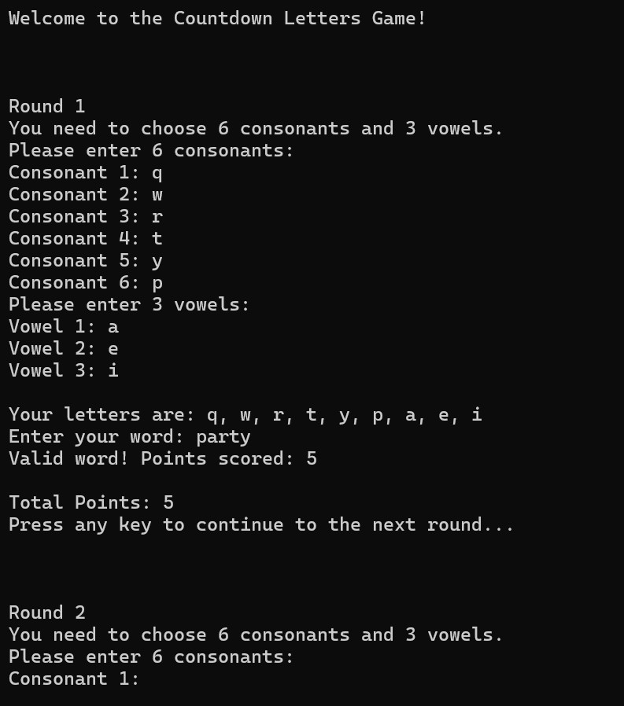
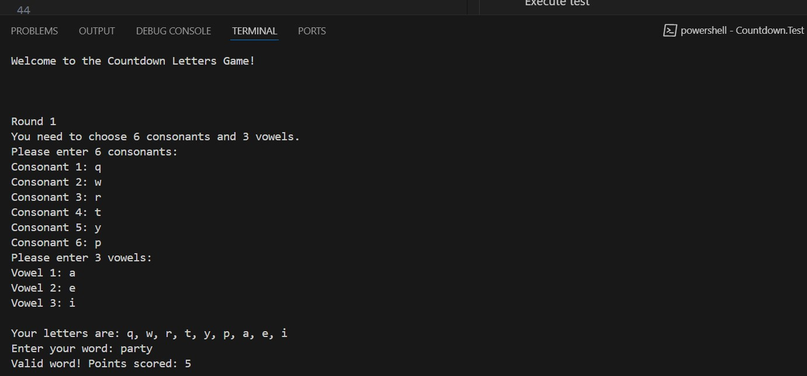
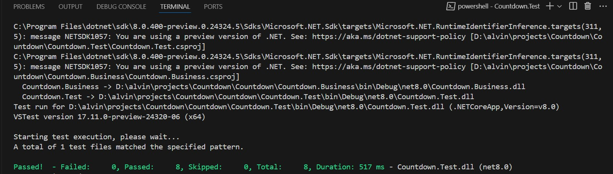
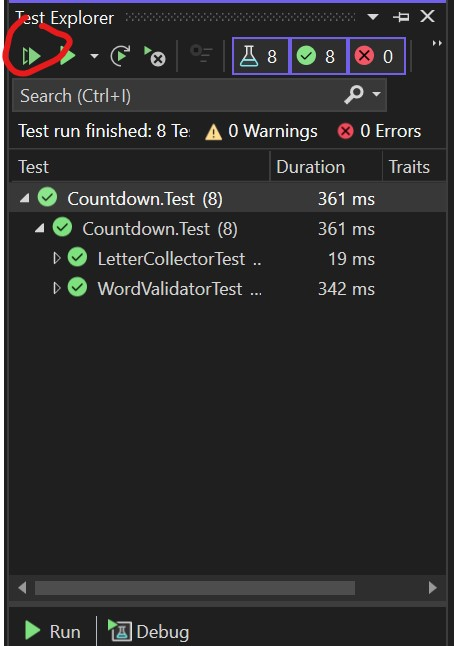

# Countdown Letters Game App

## Overview
An app that simulates rounds of the Countdown letters game.

## Features
- The game consists of 4 rounds.
- In each round, the user must enter 6 consonants and 3 vowels.
- The user is then asked to enter the longest word possible using the given letters.
- The entered word will be validated to check if it is a valid English word.
- The word will be scored based on the number of letters.
- The app will calculate the total points accumulated in each round.



## Prerequisites

- [.Net 8 SDK](https://dotnet.microsoft.com/en-us/download/dotnet/8.0)
- Visual Studio or VS Code

## Technology Used
- [WeCantSpell.Hunspell](https://github.com/aarondandy/WeCantSpell.Hunspell)
  - For validating English word (Nuget)
- XUnit - Unit test

## Usage
### Using VS Code
#### Running/debugging
Navigate to the main project's folder
```
cd Countdown
```

Execute run
```
dotnet run
```



#### Unit testing
Navigate to the unit test project's folder
```
cd Countdown.Test
```

Execute test
```
dotnet test
```



### Using Visual Studio
#### Running/debugging
- Make sure the default project is **Countdown**.
- Run by pressing **F5**.


#### Unit testing
- Open **Test Explorer**
- The panel should load the available Unit Tests.
- Click the play button to run the tests.

